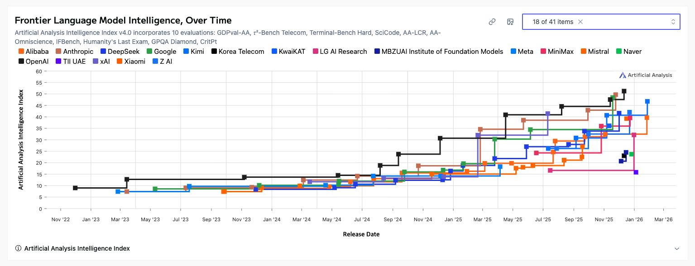

# Agent CLI

## 정의

- 터미널 환경에서 자연어나 특정 명령어를 통해 AI 모델을 호출하여 코드 작성, 디버깅, 문서화 등 개발 작업을 자동화하는 도구

## Agent CLI 도구들이 발전하는 이유

- Visual Studio, VS Code, Android Studio, Xcode 등 모든 IDE에 동일한 스펙의 AI 기능을 연결하는 건 굉장히 많은 리소스가 필요
- 터미널은 어느 환경이든 존재하고, 터미널 환경에서는 이미 시스템 및 파일 접근 권한을 거의 대부분 가지고 있기 때문에 코드 수정, 파일 수정 등이 자유로움
- 한 번 잘 만들어둔다면 모든 개발자가 사용할 수 있는 툴로 사용 가능

## Agent CLI 종류

- Claude Code (유료)
  - Claude (Anthropic)
- Gemini CLI (무료)
  - Gemini (Google)
- Cursor CLI (유료)
  - Cursor 구독 필요
  - 다양한 AI 모델 지원 (Claude, GPT, Gemini, Grok 등)
  - 어떤 IDE에서든 사용 가능하며, 스크립트/자동화 워크플로우에 활용 가능
- Codex CLI (오픈소스, API 비용 별도)
  - OpenAI에서 제작한 오픈소스 CLI 도구 (MIT 라이센스)
  - CLI 도구 자체는 무료이나, OpenAI API 호출 비용은 별도 발생
- Open Code (무료)
  - 오픈 소스
- 그 외에도 정말 다양한 CLI 툴들이 존재
  - 다양한 AI 모델 지원 (Claude, GPT, Gemini 등)

## AI 모델 별 성능 변화

- 특정한 모델만 고집해서 사용할 이유 X

## Open Code와 Claude Code

- Claude Code는 구독 모델과 API 사용당 모델이 존재
- Open Code는 100% 오픈 소스이며 Claude, GPT, Gemini, Grok, 로컬 모델 등 사용 가능
- Open Code에서 Claude Code의 구독 모델(Max 플랜) 연동 시 주의사항:
  - Max 플랜은 공식적으로 Claude Code CLI 전용으로 제공됨
  - 외부 도구에서의 사용은 Anthropic 서비스 약관(ToS) 위반 가능성이 높음
- Anthropic은 자사 CLI 도구 사용을 권장함 (폐쇄형, Claude 생태계 종속)

---

# Flutter Web 배포

## Github Pages

- Github Actions를 통해 Github Pages에 배포하는 방식
- .github/workflows/xxx.yaml 파일에 세팅
- Github Marketplace에 존재하는 Actions 활용 가능

## Cloudflare Pages

- Github Repository와 연동하여 Cloudflare Pages에 배포하는 방식
- Cloudflare Page - Settings - Build configuration 쪽에 세팅
- GitHub Actions 같은 별도 CI/CD 설정 없이 내장 빌드 시스템 사용
  - CI/CD: 코드 변경 시 자동으로 빌드, 테스트, 배포하는 자동화 파이프라인
- 빌드 없이 **이미 빌드된 파일 업로드 가능**

## 그 외

- Flutter Web은 정적 파일
  - 정적 파일: 서버에서 별도 처리 없이 그대로 제공되는 HTML, CSS, JS 파일
- 정적 호스팅을 할 수 있다면 어디든 가능 (AWS S3, Firebase Hosting 등)

## Flutter Web 배포 시 주의사항

- Flutter Web은 기본적으로 **HashUrlStrategy**를 사용하여 URL에 `#`이 포함됨
  - 예: `https://example.com/#/home`
- **PathUrlStrategy** 사용 시 (URL에서 `#` 제거):
  - 예: `https://example.com/home`
  - GitHub Pages나 정적 호스팅에서 새로고침 또는 직접 URL 접근 시 404 에러 발생 가능
  - 서버 측에서 모든 경로를 index.html로 리다이렉트하는 설정 필요

---

# Next.js 배포

## Vercel

- Next.js 제작사
- 별도의 설정이 거의 필요 없음
- 트래픽이 늘었을 때 비용이 급증
- Vercel 생태계 종속
  - 생태계 종속: 특정 플랫폼에 의존하게 되어 다른 서비스로 이전이 어려워지는 상황

## Cloudflare Pages

- 비용 예측이 쉬움
- 효율적인 CDN 환경 (글로벌 캐싱)
  - CDN (Content Delivery Network): 전 세계에 분산된 서버에서 콘텐츠를 제공하여 로딩 속도를 높이는 기술
  - 글로벌 캐싱: 사용자와 가까운 서버에 데이터를 미리 저장해두어 빠르게 제공
- Node API 일부 제약
  - Cloudflare Pages는 Node.js 런타임이 아닌 **V8 isolates** 환경에서 동작
  - V8 isolates: Chrome 브라우저의 JavaScript 엔진을 기반으로 한 경량 실행 환경
  - `fs`(파일 시스템), `path`(경로 처리) 등 Node.js 네이티브 모듈 사용 불가
  - 일부 npm 패키지가 호환되지 않을 수 있음
- Next.js 최신 기능이 늦게 지원될 수 있음

## 그 외

- 정적 파일로 웹사이트를 배포할 수 있다면 Flutter Web의 배포와 동일
  - Next.js를 정적 파일로 배포하려면 `next.config.js`에서 `output: 'export'` 설정 필요
  - 이 경우 SSR, API Routes, ISR 등의 기능 사용 불가
    - SSR (Server Side Rendering): 서버에서 HTML을 생성하여 전달하는 방식
    - API Routes: Next.js 내장 백엔드 API 기능
    - ISR (Incremental Static Regeneration): 빌드 후에도 특정 페이지만 점진적으로 재생성하는 기능
- 정적 배포에 적합한 경우:
  - 블로그
  - 랜딩 페이지
  - 문서 사이트
  - 자주 변하지 않는 데이터
  - SEO 중요한 페이지
    - SEO (Search Engine Optimization): 검색 엔진에서 상위에 노출되도록 최적화하는 작업

---

# 실습

- Agent CLI와 함께 Flutter로 Todo App 만들기
- Flutter Web 배포
- Agent CLI와 함께 Nextjs 기본 프로젝트 배포
- 시간이 된다면 Flutter Todo App Firebase 연동
